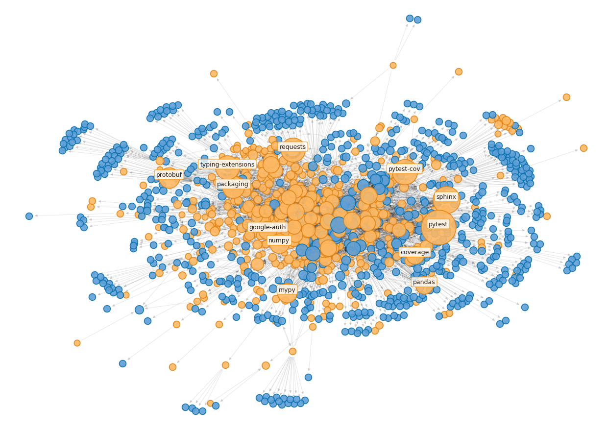

# Eric Zander

**`Machine Learning | Data Science | Applied History`**

## About Me

Starting with a background in applied history, I have followed the impact of emerging technologies. This interest led me to the fields of data science and machine learning, where I apply analytical skills alongside historical insights to view data science as a modern form of applied history.

In my early projects, I focused on explainable modeling for medicine, both in diagnosis and treatment. This work laid the foundation for my ongoing interest in making complex systems more transparent and understandable. I've presented at fuzzy logic conferences on methods for explainable control systems and have developed machine learning curricula to make complex concepts more accessible.

Currently, I am in my second year of pursuing a Master of Science in Computer Science at the University of Oregon, where my interests have expanded to include graph machine learning and probabilistic methods in AI.

I also enjoy fitness, video games, and the universally beloved film Chicken Little.

## Skills

- **Programming**: Python (Data Science, ML), C/C++
- **Tools**: Git, VS Code, Cursor
- **Cloud**: AWS, GCP
- **OS**: Windows, Linux (Debian)
- **Office**: PowerPoint, Excel/Google Sheets

- **Data Science & Machine Learning**:
  - **Libraries**:
    - NumPy, TensorFlow, PyTorch, Pandas, Matplotlib, Seaborn, SciPy, NetworkX, Numba, Scikit-learn, Sphinx, Pytest
  - **Techniques**:
    - NLP (Classification, Regression)
    - Image Processing (Classification, Segmentation)
    - Graphs (Classification, Anomaly Detection)
    - Supervised Learning (Classification, Regression)
    - Unsupervised Learning (Clustering, Dimensionality Reduction, Anomaly Detection, Rule Learning)
    - Reinforcement Learning
    - Self-supervised Learning (Contrastive Learning)
    - Genetic Algorithms
    - Fuzzy Logic

## Portfolio Projects

> Under construction
- **[WIP] Anomaly Detection in PyPi Dependency Graphs // [GitHub](https://github.com/ericzander/pypi-anomaly-detection)**

  

## Education

- **MS in Computer Science**  
  University of Oregon  
  *In progress, expected graduation 2025*

- **BS in Computer Science in Machine Learning**  
  DigiPen Institute of Technology  
  *Minor in Mathematics*  
  *Summa Cum Laude, 2023*

- **BA in History and Psychology**  
  Gonzaga University  
  *Magna Cum Laude, 2019*

## Experience

- **Summer Instructor**  
  *Machine Learning and Its Applications*  
  Open World with DigiPen, Jun 2023 - Aug 2023

- **K-12 Summer Curriculum Developer**  
  *Machine Learning*  
  Open World with DigiPen, Oct 2022 - May 2023

- **Teaching Assistant**  
  *Data Analysis*  
  DigiPen Institute of Technology, Sep 2021 - Apr 2023

- **Research Writer**  
  Microsoft through Simplicity Consulting, Jan 2021 - May 2021

## Certifications

- [AWS Certified Solutions Architect - Associate (SSA)](https://www.credly.com/badges/2029d1cf-7fef-4543-9537-0203fa8308d5/public_url) - Issued: May 2024
- [AWS Certified Cloud Practitioner (CCP)](https://www.credly.com/badges/200078e5-36cb-4908-a710-82f87d6124f6/linked_in_profile) - Issued: January 2024
- [Google Data Analytics Professional Certificate](https://www.credly.com/badges/5eef71f4-84ff-4eb1-8c89-ba72dd83e265/linked_in_profile) - Issued: August 2023

## Contact Information

-  Email: eric [at] zander5 [dot] com
-  LinkedIn: [eric-zander](https://www.linkedin.com/in/eric-zander/)
-  GitHub: [ericzander](https://github.com/ericzander)
